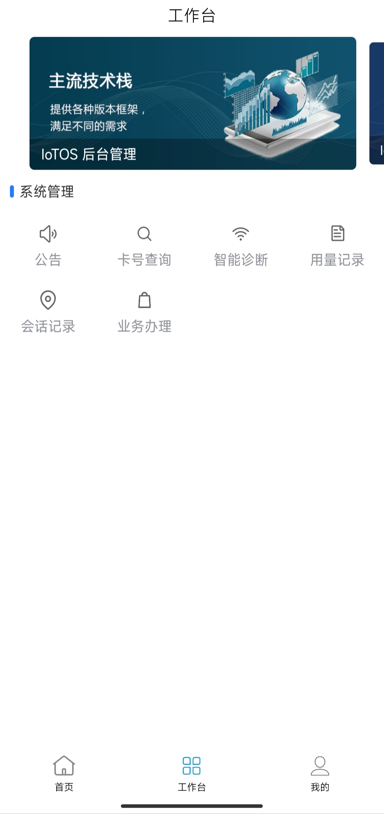

# IoTOS-App

> The backend program is https://gitee.com/chinaiot/iotos

# IoTOS-App v0.1.0

## An efficient and practical IoTCard management & operation system - mobile terminal.

> IoTOS mobile terminal; based on [RuoYi-App](https://gitee.com/y_project/RuoYi-App?_from=gitee_search) to develop and adapt to international multilingual UI using [uView](https://gitee.com /umicro/uView), integrated [J-IM](https://gitee.com/xchao/j-im?_from=gitee_search)[t-io](https://gitee.com/tywo45/t-io?_from=gitee_search) 【network framework Tanchat prototype core】

English / [中文](README.md)

          
          
<a target="_blank" href='https://gitee.com/chinaiot/iotos-app/stargazers'></img></a>
<a target="_blank" href='https://gitee.com/chinaiot/iotos-app/members'></img></a>

# 1. About IoTOS-App

## 1.1 Introduction

IoTOS-App mobile solution adopts the uniapp framework, one code adapts to multiple terminals, and supports APP, applet, H5 at the same time! Realized a mobile solution perfectly connected with [IoTOS](https://gitee.com/chinaiot/iotos) and [IoTOS-IM](https://gitee.com/chinaiot/iotos-im)! At present, basic functions such as login, international language switching, workbench, data editing, avatar modification, password modification, frequently asked questions, and about us have been realized.

* Supporting back-end code warehouse address [IoTOS](https://gitee.com/chinaiot/iotos).
* Middleware network framework [IoTOS-IM](https://gitee.com/chinaiot/iotos-im).
* The application framework is based on [uniapp](https://uniapp.dcloud.net.cn), supporting applets, H5, Android and IOS.
* The front-end component adopts [uView](https://gitee.com/umicro/uView), a full-end compatible high-performance UI framework.

## 1.2 Function introduction

> Currently in order to implement the function

- Background system notification After the user logs in, the announcement and notification will be issued in time through IoTOS-IM
- Implement internationalized languages

# 2. Demo installation package

> [iotos-app_v0.1.0.apk](/apk/iotos-app_v0.1.0.apk) under the 'apk' directory 【Android version】

# 3. Background demonstration address

Open source demo address: [http://demo.iotos.top/](http://demo.iotos.top/)

Default account password: iotos, iotos.top

# 4. Contact us

If you want to join our open source exchange group, have any ideas, opinions or suggestions on IoTOS products, or business cooperation needs, please scan the QR code to add IoTOS project authors and join the group chat:

- WeChat

- WeChat public account

# Five, project display

- login page

- workbench

- mine

- language switching

- Login announcements and notifications

