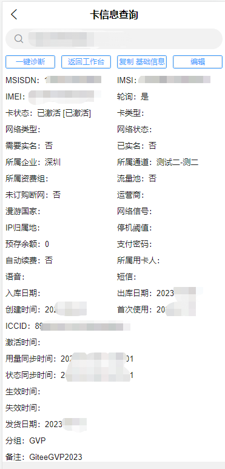

# IoTOS-App v0.6.0

> The backend program is https://gitee.com/chinaiot/iotos

## An efficient and practical IoTCard management & operation system - mobile terminal.

> IoTOS mobile terminal; based on [RuoYi-App](https://gitee.com/y_project/RuoYi-App?_from=gitee_search) to develop and adapt to international multilingual UI using [uView](https://gitee.com /umicro/uView), integrated [J-IM](https://gitee.com/xchao/j-im?_from=gitee_search)

English / [中文](README.md)

          
          
<a target="_blank" href='https://gitee.com/chinaiot/iotos-app/stargazers'></img></a>
<a target="_blank" href='https://gitee.com/chinaiot/iotos-app/members'></img></a>

# 1. About IoTOS-App

## 1.1 Introduction

IoTOS-App mobile solution adopts the uniapp framework, one code adapts to multiple terminals, and supports APP, applet, H5 at the same time! Realized a mobile solution perfectly connected with [IoTOS](https://gitee.com/chinaiot/iotos) and [IoTOS-IM](https://gitee.com/chinaiot/iotos-im)! At present, basic functions such as login, international language switching, workbench, data editing, avatar modification, password modification, frequently asked questions, and about us have been realized.

* Supporting back-end code warehouse address [IoTOS](https://gitee.com/chinaiot/iotos).
* Middleware network framework [IoTOS-IM](https://gitee.com/chinaiot/iotos-im).
* The application framework is based on [uniapp](https://uniapp.dcloud.net.cn), supporting applets, H5, Android and IOS.
* The front-end component adopts [uView](https://gitee.com/umicro/uView), a full-end compatible high-performance UI framework.

## 1.2 Function Introduction

> Currently implemented functions

- Background system notification After the user logs in, the announcement and notification will be issued in time through IoTOS-IM
- Implement internationalized languages

# 2. Demo installation package

- [iotos-app_v0.6.0.apk](/apk/iotos-app_v0.6.0.apk) under the 'apk' directory 【Android version】
- [iotos-app_v0.1.0.apk](/apk/iotos-app_v0.1.0.apk) under the 'apk' directory 【Android version】

# 3. Background demonstration address

Open source demo address: [http://demo.iotos.top/](http://demo.iotos.top/)

Default account password: iotos, iotos.top

# 4. Contact us

If you want to join our open source exchange group, have any ideas, opinions or suggestions on IoTOS products, or business cooperation needs, please scan the QR code to add IoTOS project authors and join the group chat:

- WeChat

- WeChat public account

# 5. Update log

## V0.1.0 update log

- [x] Multilingual internationalization;
- [x] system notifications and announcements;

## V0.6.0 update log

- [x] Workbench UI style optimization Workbench added card number query jump function After entering the card number, click the jump function to automatically load the card number and fill in the function search or pending execution state; after the search returns, load the last searched card number in the search box middle. ;
- [x] Added card information query. Single card information query is adapted to PC card details display; provides one-key copy function to clipboard; can edit IMEI, remarks, and grouping. Provide one-click jump to intelligent diagnosis. ;
- [x] Added intelligent diagnosis Adapted to PC-side intelligent diagnosis, restoring diagnostic animation and information display; card status, device status, frozen or not, communication services, policy restrictions, and status change records. ;
- [x] Added usage records Adapted PC-side usage records to display usage records, daily usage, and monthly usage record dates in the form of table rows, and provide one-click copying to the clipboard for monthly query. ;
- [x] Added session records Adapted to PC-side session records; display session time, online status, access method, APN, IP address, ipv6, ipv6Prefix;
- [x] Added batch business processing to adapt to PC-side batch business processing; provide batch shutdown & disconnection, network reset, and flexible card status change; single-time 100 card number limit, tasks can be performed on the PC side Inquire. ;
- [x] Added IoTOS interface, which mainly displays update log records. ;
- [x] New message interface UI. If you expand the company's internal communication messages or push message display to provide edited message display, it will pave the way for subsequent business. Those who are interested can expand by themselves. ;

# Six, project display

## login page

## Workbench

## mine

## Language switching

## Login announcements and notifications

## Card information query

## session recording

## Intelligent diagnosis

## usage record

## Business handling

## Notification message

> View Changelog page

## Notification message

> Not implemented yet, only improved single-interface ui

