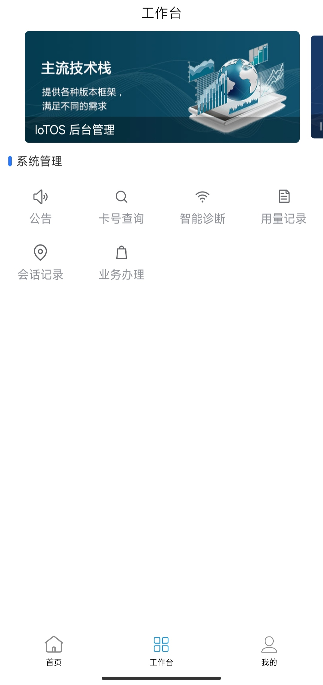

# IoTOS-App v0.1.0

> 后端程序为 https://gitee.com/chinaiot/iotos

## 一款高效实用 IoTCard 管理 & 运营系统 - 移动端。

> IoTOS 移动端；基于[RuoYi-App](https://gitee.com/y_project/RuoYi-App?_from=gitee_search) 开发 适配国际化多语言 UI 使用 [uView](https://gitee.com/umicro/uView) ，集成 [J-IM](https://gitee.com/xchao/j-im?_from=gitee_search)([t-io](https://gitee.com/tywo45/t-io?_from=gitee_search) 网络框架 谭聊原型核心)

中文 / [English](README.en.md)

          
          
<a target="_blank" href='https://gitee.com/chinaiot/iotos-app/stargazers'></img></a>
<a target="_blank" href='https://gitee.com/chinaiot/iotos-app/members'></img></a>

# 一、 关于 IoTOS-App

## 1.1 介绍

IoTOS-App 移动解决方案，采用uniapp框架，一份代码多终端适配，同时支持APP、小程序、H5！实现了与[IoTOS](https://gitee.com/chinaiot/iotos)、[IoTOS-IM](https://gitee.com/chinaiot/iotos-im)完美对接的移动解决方案！目前已经实现登录、国际语言切换、工作台、编辑资料、头像修改、密码修改、常见问题、关于我们等基础功能。

* 配套后端代码仓库地址[IoTOS](https://gitee.com/chinaiot/iotos) 。
* 中间件网络框架[IoTOS-IM](https://gitee.com/chinaiot/iotos-im) 。
* 应用框架基于[uniapp](https://uniapp.dcloud.net.cn)，支持小程序、H5、Android和IOS。
* 前端组件采用[uView](https://gitee.com/umicro/uView)，全端兼容的高性能UI框架。

## 1.2 功能介绍

> 目前已实现功能

- 后台系统通知 用户登录后通过 IoTOS-IM 及时下发 公告 与通知
- 实现国际化语言

# 二、演示安装包

> 'apk' 目录下 [iotos-app_v0.1.0.apk](/apk/iotos-app_v0.1.0.apk)  【安卓版本】

# 三、后台演示地址

开源演示地址：[http://demo.iotos.top/](http://demo.iotos.top/)

默认账号密码：iotos，iotos.top

# 四、联系我们

如果你想加入我们的开源交流群、有任何 IoTOS 产品上的想法、意见或建议，或商务上的合作需求，请扫码添加 IoTOS 项目作者，加入群聊：

- 微信

- 微信公众号

# 五、项目展示

- 登录页

- 工作台

- 我的

- 语言切换

- 登录公告与通知

